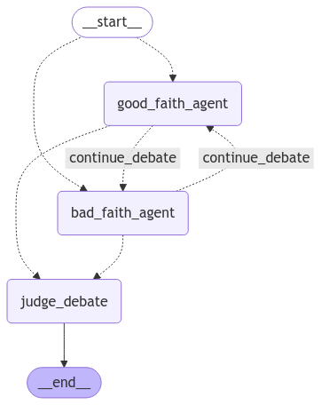

<div align="center">
<h1>Ai wise council</h1>
<h3>A sophisticated AI system that leverages multiple Large Language Models (LLMs) to provide well-rounded, comprehensive responses through a council-based approach👩‍⚖️👨‍⚖️</h3>
</div>

<div align="center">
<a href="https://contrastoai.com/" target="_blank">

</a>
<p><a href="https://contrastoai.com/" target="_blank">Contrasto.AI</a></p>
</div>

<br/>

<div align="center">

   <a href="https://www.linkedin.com/company/contrastoai" target="_blank"> 
   

</a></div>
<br/>

## Table of Contents
- [Overview](#overview)
- [Components](#components)
- [Installation](#installation)

## Overview

The challenge of AI oversight

As AI systems become increasingly sophisticated, **we face a critical challenge in ensuring their proper behavior**. Currently, human review and data labeling are the primary methods for training AI models - a requirement even mandated by the AI Act. However, this raises an important question: As AI systems surpass human knowledge, how can we effectively validate their performance? Should we rely on simpler AI models to oversee more advanced ones, or will human oversight remain sufficient?

Our solution: AI wise council

AI wise council addresses this challenge through an innovative approach to AI decision-making. Drawing inspiration from **Anthropic's research on [scalable oversight](https://arxiv.org/pdf/2402.06782)**, we've developed a virtual council system that combines multiple specialized AI models. 

Here's how it works:

- Multiple AI models serve as expert debaters and judges
- Each model contributes its unique expertise and perspective
- Models engage in structured debates on complex questions
- Judge models oversee the process, evaluating:
  - Argument quality
  - Logical consistency
  - Overall reasoning

This council-based architecture produces more balanced and comprehensive responses than single-model systems. By implementing debate and oversight mechanisms, we achieve more reliable and thoughtful AI outputs while addressing the fundamental challenge of AI oversight.

*This projects is part of the 2st capstone of [Datatalks Machine Learning Engineering zoomcamp](https://github.com/DataTalksClub/machine-learning-zoomcamp/tree/master).*

## Components

### Core Scripts
- `train.py`: Model training pipeline with dataset preparation
- `finetuning.py`: Fine-tuning pipeline and model upload to Hugging Face
- `predict.py`: FastAPI server for real-time model predictions

### Components Directory
Core system components using Langchain and Langgraph:
- `agents/`: AI debate participants implementation
  - Truth-telling council member
  - Deceptive council member 
  - Judge that evaluates arguments and detects deception
- `debate/`: Debate flow using Langgraph StateGraph
  - Defines agent nodes
  - Controls turn-taking via conditional edges
  - Manages debate progression to conclusion
- `model_client/`: Model interaction implementation

### Prompts Directory  
System prompts and agent instructions:
- `constructors/`: Role-based prompt templates
- `instructions/`: Specific agent behavior guidelines

### Notebooks
- `01_agentic_debate.ipynb`: Debate system workflow demonstration
- `02_generate_dataset.ipynb`: Fine-tuning dataset generation

### StateGraph Visualization


The StateGraph above illustrates the debate flow between agents, showing:
- Initial random selection between good and bad faith agents
- Turn-taking debate cycle with conditional transitions
- Final judgment phase when debate concludes


## Installation

### 1. Prerequisites 📑✅
- Python 3.12
- Poetry for dependency management and virtual environment
  - Install from [python-poetry.org](https://python-poetry.org/)
- Make for running commands and scripts
  - Provides shortcuts defined in `Makefile`
  - Install via your system's package manager
- API Keys (add to `.env` file)
  - Hugging Face token (`HF_TOKEN`) for model management
  - OpenAI API key
  - Anthropic API key  
  - DeepSeek API key
  - Copy `.env_example` to `.env` and add your keys
- For local training:
  - NVIDIA GPU with minimum 24GB VRAM (e.g. RTX 4090, A5000)
  - CUDA 12.1 installed
  - At least 32GB system RAM
  - 100GB free disk space
- For RunPod training:
  - RunPod account with CUDA GPU for training
  - Minimum 16GB RAM
  - Minimum 50GB storage

### 2. Training Steps 🏋️‍♀🏋

#### Pre-trained transfer learning

This step loads the pretrained `phi-3-mini` model as a starting point for fine-tuning.

Key features of Phi-3 Mini:
- 3.8B parameters
- Lightweight, state-of-the-art open model
- Trained on Phi-3 datasets containing:
  - High-quality synthetic data
  - Filtered web content focused on reasoning
- Learn more: [Phi-3 Mini Documentation](https://ollama.com/library/phi3:mini)

#### Fine tune: data generation and hyperparameter tunning

Here, we focus on generating data for training the model, followed by performing hyperparameter tuning to optimize the model’s performance. 

The data generation process is described in `02_generate_dataset.ipynb`.

#### Run the training

The training process can be executed either locally or on RunPod, depending on your hardware resources, specified above

##### Local training

To train locally, execute:

```bash
make run-train
```

To train on RunPod:

1. Create a RunPod account and set up a CUDA GPU for training
2. Set up a RunPod account and configure your API keys
3. Update the `Makefile` with your RunPod API key
4. Build and push the Docker image:

#### Upload trained model to Hugging Face

Once training is complete, we upload the [saved model](https://huggingface.co/ana-contrasto-ai/ai-wise-council/tree/main) to Hugging Face for easy deployment and sharing. 

### 3. Deployment Steps 🐳🐳
Clone the repository:

   ```bash
   gh repo clone AnaBelenBarbero/ai-wise-council
   cd ai-wise-council
   ```

#### a) Run local venv
1. Install dependencies:

    ```bash
    poetry install
    ```

2. Run FastAPI:

    ```bash
    make run-api-dev
    ```

#### b) Run local Docker container
1. Build the container:

    ```bash
    make docker-build-local
    ```

2. Run the container, mapped to `localhost:80`:

    ```bash
    make docker-run-local
    ```

#### c) GCP Cloud run deployed
The `deploy` branch of the project is synced with GCP Cloud Run via Continuous Deployment (CD), so any commit merged there will be built and deployed automatically.

Check `04_calling_GCP_deployed_model.ipynb` for authentication and request-building details.
